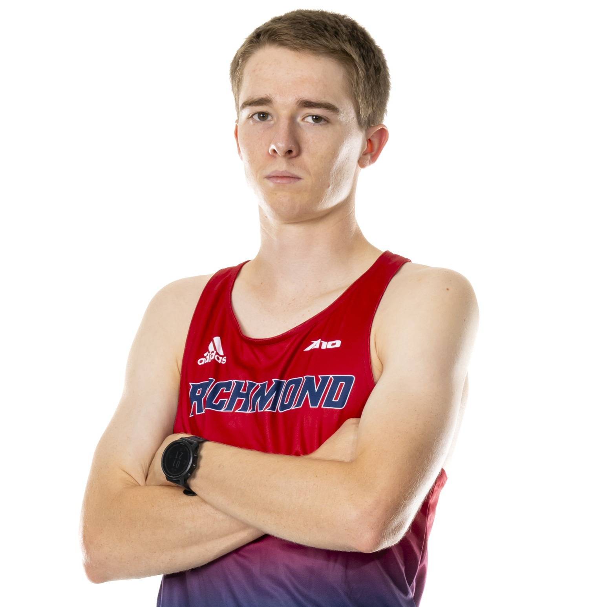

<!DOCTYPE html>
<html lang="en">
<head>
    <meta charset="UTF-8">
    <meta name="viewport" content="width=device-width, initial-scale=1.0">
    <title>Coach Taylor | Track & Cross Country Performance Coaching</title>
    <!-- Load Tailwind CSS -->
    
    
</head>
<body class="bg-gray-50 text-gray-800">

    <!-- Tailwind Config for Inter font and default color palette -->
    

    <!-- Header & Navigation -->
    <header class="bg-white shadow-md sticky top-0 z-10">
        

            

                Coach Taylor
            

            <nav class="hidden md:flex space-x-8">
                <!-- Updated Navigation Links -->
                <a href="#expertise" class="text-gray-600 hover:text-primary transition duration-150 font-medium">Expertise</a>
                <a href="#credibility" class="text-gray-600 hover:text-primary transition duration-150 font-medium">Highlights</a>
                <a href="#services" class="text-gray-600 hover:text-primary transition duration-150 font-medium">Coaching</a>
                <a href="#philosophy" class="text-gray-600 hover:text-primary transition duration-150 font-medium">Session Plan</a>
                <a href="#contact" class="px-4 py-2 rounded-full bg-secondary text-white hover:bg-opacity-90 transition duration-150">Contact Now</a>
            </nav>
        

    </header>

    <!-- Hero Section -->
    <section class="bg-primary pt-20 pb-24 text-white">
        

                
            <h1 class="text-5xl md:text-7xl font-extrabold leading-tight tracking-tight mb-4">
                Unleash Your Full Running Potential
            </h1>
            

                Personalized running coaching in the Durham, NC area. Remote guidance available globally.
            

            <a href="#contact" class="cta-button inline-block text-lg font-semibold py-4 px-10 rounded-full shadow-2xl uppercase tracking-wider">
                Start Your Training Journey
            </a>
            
Serving athletes from Middle Schoolers to Marathoners.

        

    </section>

    <!-- Expertise Section (Replaces 'About/Expertise') -->
    <section id="expertise" class="py-16 md:py-24 bg-white">
        

            <h2 class="text-4xl font-extrabold text-center text-gray-900 mb-4">My Athlete-Centric Coaching Approach</h2>
            
Leveraging collegiate-level insight to build resilient, fast runners.

            

                <!-- Focus: Distance Running (400m - Half Marathon) -->
                

                    <h3 class="text-xl font-semibold mb-3 text-secondary">Distance Focus: 400m to Marathon</h3>
                    
Specializing in cross country and long-distance. Programs are designed to maximize base fitness and sharpen speed as race day approaches.

                

                <!-- Philosophy: Holistic Development -->
                

                    <h3 class="text-xl font-semibold mb-3 text-secondary">Holistic Runner Development</h3>
                    
A comprehensive approach emphasizing proper biomechanics, building a strong base, and building speed and power. Additional emphasis on sleep, mental strength, and nutrition to prevent injuries.

                

                <!-- Credibility: Experience & Accountability -->
                

                    <h3 class="text-xl font-semibold mb-3 text-secondary">Proven Competitive Background</h3>
                    
First-hand knowledge from NCAA D1 track & XC provides deep insight into competitive demands. I am to develop a relationship based on accountability and resilience.

                

            

        

    </section>
    
    <!-- New Section: Athletic Highlights (Credibility) -->
    <section id="credibility" class="py-16 md:py-24 bg-gray-900 text-white">
        

            <h2 class="text-4xl font-extrabold text-secondary mb-6">Athletic & Academic Highlights</h2>
            
I coach from a foundation of success at every level of competition.

            

                <!-- Highlight 1: Collegiate Success -->
                

                    
3rd Place

                    
National Championship

                    
Collegiate Running Association (CRA) National Championship for Trail 10K & Road 10K.

                

                <!-- Highlight 2: Academic Excellence -->
                

                    
University of Richmond

                    
NCAA D1 Team

                    
Member of the Spider men's Division 1 XC team as a graduate student.

                

                <!-- Highlight 3: High School Records -->
                

                    
Record Holder

                    
High School & Collegiate Club

                    
Former Riverside High School record holder (4x800m, 1600m, 3200m, 5K XC) and UNC Club Running (4x800m, 3K Steeple, 5000m, 6K XC, and Tar Heel Double Down)

                

            

        

    </section>

    <!-- Services Section (No changes needed here yet, structure is strong) -->
    <section id="services" class="py-16 md:py-24 bg-gray-100">
        

            <h2 class="text-4xl font-extrabold text-center text-gray-900 mb-4">Coaching Services</h2>
            
Flexible options to fit your lifestyle and goals.

            

                <!-- Service Card 1: Premium 1-on-1 -->
                

                    <h3 class="text-2xl font-bold text-gray-900 mb-4">Premium 1-on-1 Coaching</h3>
                    
The ultimate experience for athletes looking to go the extra mile. Includes unlimited communication, training adjustments, form guidance, and race-day strategy sessions.

                    <ul class="space-y-3 text-left text-gray-700">
                        <li class="flex items-start">
                            <svg class="flex-shrink-0 h-6 w-6 text-secondary mr-2 mt-0.5" fill="none" viewBox="0 0 24 24" stroke="currentColor"><path stroke-linecap="round" stroke-linejoin="round" stroke-width="2" d="M5 13l4 4L19 7" /></svg>
                            Weekly check-in (call or workout)
                        </li>
                        <li class="flex items-start">
                            <svg class="flex-shrink-0 h-6 w-6 text-secondary mr-2 mt-0.5" fill="none" viewBox="0 0 24 24" stroke="currentColor"><path stroke-linecap="round" stroke-linejoin="round" stroke-width="2" d="M5 13l4 4L19 7" /></svg>
                            Personalized shared training plan
                        </li>
                        <li class="flex items-start">
                            <svg class="flex-shrink-0 h-6 w-6 text-secondary mr-2 mt-0.5" fill="none" viewBox="0 0 24 24" stroke="currentColor"><path stroke-linecap="round" stroke-linejoin="round" stroke-width="2" d="M5 13l4 4L19 7" /></svg>
                            Strength and mobility routines included
                        </li>
                    </ul>
                    <a href="#contact" class="mt-8 block text-center py-3 bg-primary text-white font-semibold rounded-lg hover:bg-primary-dark transition duration-150">Inquire About Availability</a>
                

                <!-- Service Card 2: Custom Training Plan -->
                

                    <h3 class="text-2xl font-bold text-gray-900 mb-4">Custom Training Plan</h3>
                    
A comprehensive training plan built specifically for your target race distance, current fitness, and weekly time constraints.

                    <ul class="space-y-3 text-left text-gray-700">
                        <li class="flex items-start">
                            <svg class="flex-shrink-0 h-6 w-6 text-primary mr-2 mt-0.5" fill="none" viewBox="0 0 24 24" stroke="currentColor"><path stroke-linecap="round" stroke-linejoin="round" stroke-width="2" d="M5 13l4 4L19 7" /></svg>
                            12-16 week plan for a specific goal (e.g., 5k, 10k, Half/Full Marathon)
                        </li>
                        <li class="flex items-start">
                            <svg class="flex-shrink-0 h-6 w-6 text-primary mr-2 mt-0.5" fill="none" viewBox="0 0 24 24" stroke="currentColor"><path stroke-linecap="round" stroke-linejoin="round" stroke-width="2" d="M5 13l4 4L19 7" /></svg>
                            Initial consultation (60 mins) to assess history and goals
                        </li>
                        <li class="flex items-start">
                            <svg class="flex-shrink-0 h-6 w-6 text-primary mr-2 mt-0.5" fill="none" viewBox="0 0 24 24" stroke="currentColor"><path stroke-linecap="round" stroke-linejoin="round" stroke-width="2" d="M5 13l4 4L19 7" /></svg>
                            Detailed pace guide and workout explanations
                        </li>
                    </ul>
                    <a href="#contact" class="mt-8 block text-center py-3 bg-secondary text-white font-semibold rounded-lg hover:bg-secondary-dark transition duration-150">Order Your Custom Plan</a>
                

            

        

    </section>

    <!-- Coaching Philosophy Section (Now focused on Session Structure) -->
    <section id="philosophy" class="py-16 md:py-24 bg-white">
        

            <h2 class="text-4xl font-extrabold text-gray-900 mb-6">The Anatomy of a High-Performance Session</h2>
            

                Every session is structured to maximize development, focus on form, and build race-day confidence.
            

            

                

                    
1

                    

                        <h3 class="text-xl font-semibold text-gray-900">Baseline Recap & Goal Alignment</h3>
                        
We start with a "baseline recap" to discuss recent training and refresh goals. This establishes immediate accountability and focus for the work ahead.

                    

                

                

                    
2

                    

                        <h3 class="text-xl font-semibold text-gray-900">Technical Drills & Targeted Workouts</h3>
                        
The core focuses on a dynamic warm-up and speed/agility work, followed by goal-based training focused on attacking all aspects of the race.

                    

                

                

                    
3

                    

                        <h3 class="text-xl font-semibold text-gray-900">Constant Feedback & Debrief</h3>
                        
I provide constant feedback during training for immediate correction, concluding the session with a thorough cool-down and debrief on takeaways for the next training block.

                    

                

            

        

    </section>

    <!-- Contact Section -->
    <section id="contact" class="py-16 md:py-24 bg-primary text-white">
        

            <h2 class="text-4xl font-extrabold text-center mb-4">Ready to Run Faster?</h2>
            

                Let's discuss your goals. Please fill out the Google Form below and I'll get back to you within 24 hours.
            

            

                <iframe src="https://docs.google.com/forms/d/e/1FAIpQLSdEFK0o2cJ5i8eJArSfvK6_mzLfu9i6l7TdesVfJkAANMs4uw/viewform?embedded=true" width="100%" height="900" frameborder="0" marginheight="0" marginwidth="0">Loading…</iframe>
            

        

    </section>

    <!-- Footer -->
    <footer class="bg-gray-900 text-white py-8">
        

            
&copy; 2024 Coach Taylor. All rights reserved.

            

                <a href="mailto:your_email@example.com" class="hover:text-secondary transition duration-150">Email</a>
                |
                <a href="#" class="hover:text-secondary transition duration-150">Instagram (Placeholder)</a>
            

        

    </footer>

</body>
</html>
